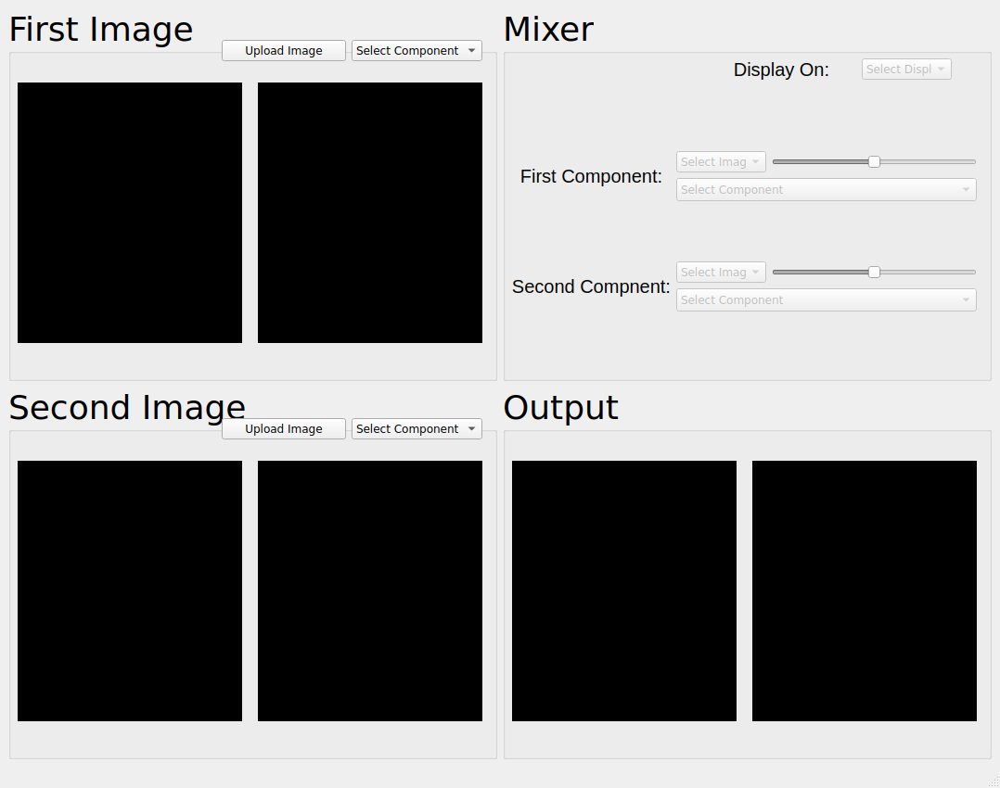
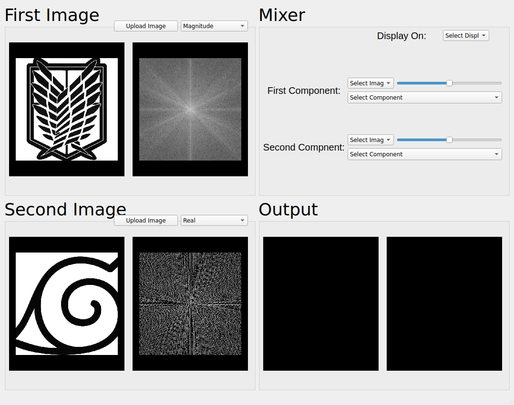
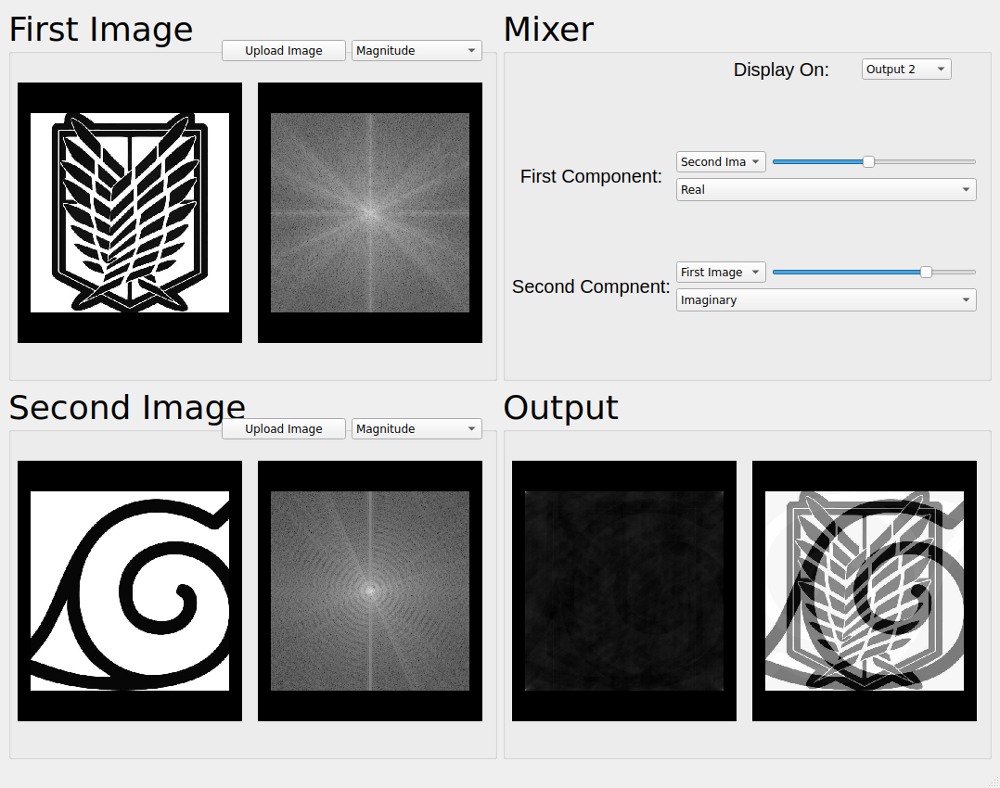

# Magnitude Phase Mixer

## Purpose

* Visualizing different image components (Magnitude, Phase, Real and Imaginary).

* Mixing two images with different modes (Magnitude/Phase, Real/Imaginary) with different weights of every component.

* The visualization and mixing is automatic and works on the fly.

## Usage

1. Load two images.

2. Choose which component to view for each image.

3. After loading two images, you can use the mixer to see the effect of mixing different components on the image.

4. Choose which output box to show in the mixed image, and the component you want to mix and its weight.

## Screanshots

### 1. Initial Screen:

### 2. Loading two different images:

#### The component displayed in the first image is the magnitude component while in the second image it's the Real component

### 3. Mixing different image components:

#### The first output (on the left) is Magnitude/Phase mix, while the second output is the Real/Imaginary mix with the same ratio

